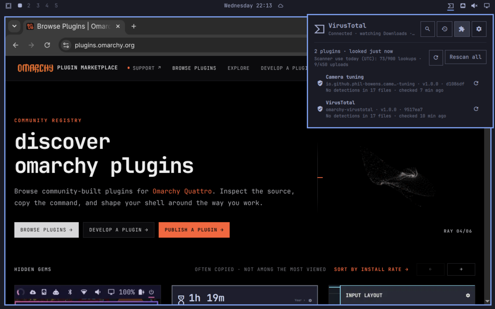

# VirusTotal for Omarchy

A community plugin for the [Omarchy](https://omarchy.org) shell (Quattro) that checks URLs, domains, IP addresses, file hashes and local files against VirusTotal from the bar. It can also watch your Downloads folder **and your installed Omarchy plugins**, and alert you when VirusTotal flags a new file.

It also connects [Omarchy's coding agents](https://omarchy.org/manual/ai/) (Claude Code, Codex, OpenCode and the rest) to VirusTotal AI, and can hand a result to your default agent for a closer look.

It talks to the public [VirusTotal AI API](https://ai.virustotal.com) (VTAI) with `curl`. There is nothing to build and no binary to install.



## Features

- **Bar icon** with a status dot: red when engines flagged a file as malicious, yellow for any other flag (suspicious detections or an AI insight), dimmed while a check is running.
- **Scan tab**: paste a URL, domain, IP, MD5/SHA-1/SHA-256 hash or an absolute file path (`~/…` and `file://` work too).
  - Files are hashed locally; only the SHA-256 is looked up.
  - The result card shows what VirusTotal returned: flagged/total engines, the per-category counts, the most common detection labels, the file type, the most severe AI insight, the SHA-256 and a link to the full report. Malicious detections get a red stop sign, suspicious-only ones a yellow exclamation mark.
  - Hashes that don't fit are shortened in the middle with `…`; the report shows them in full.
  - An unknown file (32 MB or smaller) can be uploaded for analysis, always after a confirmation dialog. The panel then follows the analysis until it finishes.
- **Recent downloads**: the four newest files in your Downloads folder, each checked with one click.
- **History tab**: the last 50 checks, kept across restarts.
- The plugin never issues its own verdict: headlines are the raw counts (e.g. `2/91 flagged`) and AI insights are shown as returned.
- **Downloads watcher** (off by default): looks up each new download and notifies you when VirusTotal engines or AI insights flag it. It never uploads anything by itself.
- **Plugin scanner** (off by default): notices when an Omarchy plugin is installed or updated and looks up every file of it on VirusTotal, several requests at a time within the API quota. Unknown files are uploaded only if you turned that on.
- **Agents tab**: one button adds the VirusTotal AI MCP server to every installed Omarchy coding agent and links a `virustotal` skill that tells them how to look things up and report. Each agent signs in with your Google account; no token is written to agent settings. See [Coding agents](#coding-agents).
- **Ask &lt;agent&gt;**: hands a finished lookup or a download alert to your default Omarchy agent.
- **Keyboard friendly**: type straight away and press <kbd>Enter</kbd>; tabs, lists and settings all have keys. See [Keyboard](#keyboard).
- Follows your Omarchy theme. Warnings use the theme's own yellow; themes whose "yellow" is another colour (matte-black, vantablack, …) get an amber instead.

## Requirements

- Omarchy with the Quattro shell.
- `curl`, `sha256sum`, `stat` and `date` (curl plus coreutils, present on a standard Omarchy install). The plugin scanner also needs `find`, `sort` and `head`, and reads a plugin's commit with `git` when it is installed.
- For the Downloads watcher and the recent downloads list: the `Qt.labs.folderlistmodel` QML module, part of `qt6-declarative`, which Quickshell already depends on. Without it the rest of the plugin keeps working.
- Notifications use `omarchy-notification-send` (bundled with Omarchy), or `notify-send` as a fallback.
- For the Agents tab: `jq` to read and edit the agents' JSON settings and `wl-copy` for the Copy buttons (both ship with Omarchy). Without `jq`, agents with JSON settings show as unreadable and are left untouched.

## Install

```bash
omarchy plugin add https://github.com/dsecuma/omarchy-virustotal --enable
```

`omarchy plugin add` clones the repository into `~/.config/omarchy/plugins/io.github.dsecuma.virustotal`, validates it and, with `--enable`, asks which bar section to use (right by default). Nothing is compiled or run during installation, and no root access is needed.

Once the plugin is listed on [plugins.omarchy.org](https://plugins.omarchy.org), you can also install it from there.

Update with `omarchy plugin update io.github.dsecuma.virustotal`. The [changelog](CHANGELOG.md) lists what changed in each version.

## Quick start

1. Click the VirusTotal icon in the bar.
2. Press **Connect**. This registers your computer with VirusTotal AI once. You don't need a VirusTotal account or API key, and nothing is sent to VirusTotal before this step. See [Connecting to VirusTotal AI](#connecting-to-virustotal-ai).
3. In the **Scan** tab, type or paste a URL, domain, IP address, hash or file path and press <kbd>Enter</kbd>, or press **Check** next to a recent download. **Open report** opens VirusTotal's full report.
4. Optional, in **Settings** (<kbd>5</kbd>):
   - **Check new downloads** looks up every new file in your Downloads folder. See [Downloads watcher](#downloads-watcher).
   - **Check installed plugins** looks up the files of every Omarchy plugin you install or update. See [Plugin scanner](#plugin-scanner).
   - Both send only hashes. Nothing is uploaded unless you allow it.
5. Optional, in **Agents** (<kbd>4</kbd>):
   - **Connect installed agents** gives your coding agents VirusTotal AI.
   - **Sign in**, on each agent's row, connects that agent to your Google account. Once per agent.
   - **Change** picks Omarchy's default agent, the one the **Ask** buttons on results open.
   - See [Coding agents](#coding-agents).
6. Optional: [open the panel with a key](#open-the-panel-with-a-key).

Every setting and its default is listed in [Settings](#settings).

### Open the panel with a key

Omarchy keeps your own key bindings in `~/.config/hypr/bindings.lua`. Add a line like this one, with a combination that is still free (`omarchy menu keybindings --print` lists the current ones):

```lua
o.bind("SUPER + SHIFT + V", "VirusTotal", { panel = "io.github.dsecuma.virustotal" })
```

The key opens and closes the panel, like a click on the bar icon. From a script, `omarchy-shell shell toggle io.github.dsecuma.virustotal` does the same.

## Connecting to VirusTotal AI

The first time, the panel shows a **Connect** card. Nothing is sent to VirusTotal before you click it.

- **Connect** registers this computer once as an `omarchy` agent (`POST /api/v3/agents/register`). No VirusTotal API key is needed.
- The agent token is written to `${XDG_CONFIG_HOME:-~/.config}/vtai/auth.header` with mode 600, the location the VTAI guide recommends. Other VTAI clients can reuse the same file, and if one already exists the plugin uses it instead of registering again.
- `curl` reads the token straight from that file (`-H @file`). It never appears in QML, in logs or in any process's command line.
- **Settings → Check access** asks VirusTotal whether the token still works. It uses no quota.
- **Settings → Disconnect** revokes the token on the server and deletes the file. Any other tool using that file stops working until you connect again.

If you try a check before connecting, the panel keeps what you typed and runs it right after you connect.

## Privacy and uploads

- A lookup sends only the URL, domain, IP or hash.
- A local file is hashed on your machine and only its SHA-256 is sent.
- A file is uploaded only when you click **Upload for analysis** and accept the dialog. The upload is a *standard, non-private submission* (`X-VTAI-Consent: standard-v1`): the file becomes available to the VirusTotal security community and its partners. Don't upload personal documents, internal code or anything that contains credentials.
- The file is hashed again right before sending; if it changed since the lookup, nothing is uploaded.
- If a connection drops mid-upload, the plugin never resends the file automatically. **Check status** asks VirusTotal whether the upload arrived.
- **No detections** means no vendor flagged the item. It is not a guarantee that it is safe.

## Downloads watcher

Enable it in **Settings → Downloads → Check new downloads**. It watches the folder from `XDG_DOWNLOAD_DIR` (or `~/Downloads`).

- Files already in the folder when the watcher starts are never checked; only new names are.
- Browser temporary files (`.part`, `.crdownload`, …) and hidden files are ignored. A file is checked once it has not changed for a few seconds, and it is retried for up to 30 minutes while it is still being written.
- At most 20 new files are queued per change, lookups are spaced out, and files above 1 GiB are skipped.
- Each file is looked up once per session, and not again within 24 hours if it already has a report.
- Only flagged files notify, unless you turn on **Settings → Notifications → Notify for every checked file**. Clicking a notification opens the panel.
- The watcher runs once per session, whatever the number of monitors. On a replacement bar that doesn't run plugin services, the panel still works but the watcher and notifications are off.

## Plugin scanner

Enable it in **Settings → Plugins → Check installed plugins**. It watches `~/.config/omarchy/plugins` (the folder `omarchy plugin add` installs into), and also checks it every 10 minutes and whenever you open the panel.

- **What counts as a change**: a new plugin folder, or a different git commit, version or file list in an existing one. The refresh button on a plugin's row (**Check this plugin again**), or **Rescan all**, checks it again.
- **The first run** takes a baseline: every installed plugin is scanned, without "new plugin" notifications.
- **What is sent**: each file is hashed locally and only its SHA-256 is looked up. `.git/`, symlinks and empty files are skipped, and at most 2,000 files per plugin are checked. Files shared by several plugins are looked up once. A file with a report is looked up again after 7 days; an unknown file after 1 hour.
- **Uploads** happen only when **Upload unknown plugin files automatically** is on. Turning it on asks for your consent once, in a dialog. Uploads are standard, non-private submissions (see [Privacy and uploads](#privacy-and-uploads)). Files above 32 MB are never uploaded, and each file is hashed again right before sending. After an upload the scanner follows the analysis and looks the file up again a little later to collect AI insights.
- **What counts as flagged**: only VirusTotal's own results. Engines flagged the file as malicious or suspicious, or a Code Insight / AI insight returned a malicious or suspicious verdict. The plugin makes no judgement of its own.
- **Alerts**: a notification when a plugin is added or updated, and one when its scan finds flagged files (for example `VirusTotal flagged 2 files in <plugin>`). With **Notify for every checked file**, a scan without flagged files ends with a `No detections: <plugin>` notification. Flagged files also go into the history and light up the bar dot.
- **Plugins tab** (<kbd>3</kbd>): every installed plugin with its status, flagged/total counts and the remaining quota. Click a plugin to list its files; click a file to open its VirusTotal report.

### Engine and quota

| Engine | Credential | Default rate the scanner uses |
|---|---|---|
| VirusTotal AI (default) | The VTAI agent token from **Connect** | 48 lookups/min and 900/day; 16 uploads/min and 450/day |
| Classic API v3 | Your VirusTotal API key | 4 requests/min and 500/day (public key limits; adjustable for premium keys) |

- VirusTotal AI allows 60 lookups per minute and 1,000 per day, plus 20 uploads per minute and 500 per day, per agent token. The scanner stays below that because the Scan tab and the Downloads watcher use the same token.
- Up to 4 requests run in parallel (**Parallel requests**, 1–8). A shared token bucket keeps them within the per-minute and per-day limits. When the daily quota runs out, the scan waits until 00:00 UTC.
- If VirusTotal answers with a rate limit error, the scanner pauses and retries. A rejected key or token stops the scan until you fix it.

### Use your own API key

The plugin scanner can use a classic VirusTotal API key instead of the VTAI token. That keeps the scanner off the quota the Scan tab and the Downloads watcher use, and lets a premium key's higher limits speed it up.

1. Sign in at [virustotal.com](https://www.virustotal.com), open the menu under your user name, choose **API key** and copy the key.
2. In **Settings → Plugins**, turn on **Check installed plugins** and set **Engine** to **VirusTotal API key**.
3. Paste the key into the field and press **Save** (or <kbd>Enter</kbd>).
4. With a premium key, raise **Requests per minute** and **Requests per day** to your key's limits. The defaults, 4 and 500, are the public key's limits, and they count lookups, uploads and analysis checks alike.

- Saving only checks that the text looks like a key (64 letters and digits). If VirusTotal rejects it, Settings and the Plugins tab say so at the first lookup.
- The key is saved to `~/.config/omarchy-virustotal/vt-apikey.header` with mode 600. It reaches the shell through stdin and `curl` reads it with `-H @file`, so it never appears on a command line. The trash button next to the field deletes the file.
- Only the plugin scanner uses the key. The Scan tab, the Downloads watcher and the skill's REST fallback always use VTAI.

## Coding agents

Omarchy ships [a set of coding agents](https://omarchy.org/manual/ai/) and lets you pick a default one. The **Agents** tab (<kbd>4</kbd>) gives them VirusTotal AI, so they can look up files, URLs, domains and IP addresses themselves and explain the report.

1. Press **Connect installed agents**. A dialog lists what will change; confirm it.
2. On each agent's row, press **Sign in**. It opens the agent (or its login command) in a terminal and shows the steps; you sign in to VirusTotal with your Google account. Once per agent, and once per account for Claude Code.
3. Check that it works: ask the agent for the VirusTotal report of `virustotal.com`. This uses one lookup of your quota.
4. Optional: press **Change** to pick Omarchy's default agent. Finished lookups and download alerts then get an **Ask** button.

Agents marked **Manual setup** need one step by hand: their row shows it, **Copy** puts the snippet or the details on the clipboard and **Setup guide** opens VirusTotal's instructions. [docs/agents.md](docs/agents.md) has the commands and snippets for every agent, to set them up or remove them without the panel.

- **Connect installed agents** lists what it will change and asks first. After you confirm, it links the `virustotal` skill and adds the VirusTotal AI MCP server (`https://ai.virustotal.com/mcp`) to every installed agent that has no VirusTotal entry yet. Each row also has its own **Add**.
- **Sign in once per agent.** The MCP entry holds only the URL: no token or header is written. Each agent signs in to VirusTotal with your Google account (OAuth) the first time.
- Agents that are not installed are listed but never run: Omarchy's launcher for a missing agent installs it when run, and the plugin never installs agents.
- The plugin never changes or removes an entry it did not create, and never adds a second VirusTotal entry to an agent that already has one, whatever its name.

| Agent | How it gets the MCP server | Sign in |
|---|---|---|
| Claude Code | `claude mcp add --scope user --transport http virustotal <url>`, in every Omarchy Claude account | `/mcp` → virustotal → Authenticate, in each account |
| Codex | `codex mcp add virustotal --url <url>` (Omarchy's Codex accounts share it) | `codex mcp login virustotal` |
| Antigravity | `agy mcp add --type http virustotal <url>` | `/mcp` → virustotal → Authenticate; paste the code into that dialog |
| GitHub Copilot | `copilot mcp add --transport http virustotal <url>` | `/mcp auth virustotal` |
| Grok | `grok mcp add --transport http virustotal <url>` (from xAI's docs; not verified by VirusTotal) | On first use; `/mcps` shows the connection |
| OpenCode | Adds `mcp.virustotal` to `~/.config/opencode/opencode.json` | `opencode mcp auth virustotal` |
| Cursor CLI | Adds `mcpServers.virustotal` to `~/.cursor/mcp.json` | `cursor-agent mcp login virustotal` |
| Crush, Hermes, OpenClaw, Oh My Pi, Ori, Muse Code | Manual: the row shows the steps, **Copy** puts the snippet or the details on the clipboard and **Setup guide** opens VirusTotal's instructions | As the agent's docs say |
| Pi | Skill only: Pi has no MCP support by design, so the skill uses the plugin's VirusTotal AI connection | – |

- **JSON settings** (OpenCode, Cursor CLI): the previous file is kept next to it as `<file>.bak-omarchy-virustotal-<time>`, and the new one replaces it atomically with the same permissions. `jq` rewrites the file's layout. Symlinks (dotfile managers), files with comments (JSONC) and an existing `opencode.jsonc` are left alone; the row then tells you how to add the entry by hand.
- **Remove** shows only for entries the plugin added that still hold exactly its URL. It does not revoke the access you granted with Google: **VirusTotal access** opens [ai.virustotal.com/oauth/connections](https://ai.virustotal.com/oauth/connections), where you can see and revoke it.
- What the plugin added is recorded in `~/.local/state/omarchy-virustotal/agents.json`. Without that record, entries count as yours and are left alone.
- **Quota**: MCP lookups use the VirusTotal AI quota of the Google account the agent signed in with: 60 per minute and 1,000 per day, shared by every agent on that account. The skill's REST fallback uses the plugin's agent token, like the panel.

### The `virustotal` skill

[`agents/skills/virustotal/SKILL.md`](agents/skills/virustotal/SKILL.md) tells an agent how to query VirusTotal, how to read a report and what to tell you:

- It uses the MCP tools when the agent has them, otherwise REST lookups with the plugin's token file (`curl -H @file`, never printed), otherwise it asks you to connect.
- Lookups only: a file is identified by its hash and never opened, run or unpacked, and defanged URLs are not visited.
- It repeats VirusTotal's numbers and never calls something "clean" or "safe".
- Uploads are public, so the agent submits something only when you ask for it in the conversation, after a reminder.

**Link** creates a `virustotal` symlink to that folder in the skill folders Omarchy links its own skills into: `~/.agents/skills`, `~/.claude/skills`, `~/.codex/skills`, `~/.pi/agent/skills`, `~/.gemini/config/skills`, `~/.hermes/skills` and `~/.hermes/profiles/*/skills`. An existing file or folder with that name is left alone. **Unlink** removes only the links that point to this plugin.

### Ask &lt;agent&gt;

Once a default agent is chosen in Omarchy (**Change** opens Omarchy's picker), finished lookups and download alerts get an **Ask** button. It runs `omarchy agent prompt` with:

- the facts the plugin recorded, such as the type, SHA-256, name, location, VirusTotal's numbers, detection labels, AI insight and report link. URLs, domains and IPs are defanged (`hxxps://example[.]com`), and hidden or control characters in names show as `<U+202E>`-style escapes;
- the instruction to follow the `virustotal` skill (or read its `SKILL.md`), to only look things up and to ask before any upload.

> [!WARNING]
> Omarchy starts agents in auto-approve mode, so they run commands without asking you first. The first **Ask** shows a warning. **Show an "Ask" button on results**, in the Agents tab, turns the buttons off.

## Settings

Settings are saved to `~/.config/omarchy-virustotal/config.json`. The VTAI token and the API key are separate files (see [Files](#files)).

| Setting | Where | Default | `config.json` key |
|---|---|---|---|
| [Check new downloads](#downloads-watcher) | Settings → Downloads | Off | `watcherEnabled` |
| [Check installed plugins](#plugin-scanner) | Settings → Plugins | Off | `pluginScanEnabled` |
| Upload unknown plugin files automatically | Settings → Plugins, while the scanner is on | Off | `pluginAutoUpload` |
| [Engine](#engine-and-quota) | Settings → Plugins, while the scanner is on | VirusTotal AI | `pluginBackend`: `"vtai"`, or `"classic"` for an API key |
| Requests per minute, Requests per day | Settings → Plugins, with the API key engine | 4, 500 | `classicPerMin`, `classicPerDay` |
| Parallel requests | Settings → Plugins, while the scanner is on | 4 (1–8) | `maxParallel` |
| Notify for every checked file | Settings → Notifications, while the watcher or the scanner is on | Off | `notifyAll` |
| [Show an "Ask" button on results](#ask-agent) | Agents tab | On | `agentButtons` |

`agentHandoffAck` records that you have seen the auto-approve warning of the first **Ask**. A complete file looks like this:

```json
{
  "version": 1,
  "watcherEnabled": true,
  "notifyAll": false,
  "pluginScanEnabled": true,
  "pluginAutoUpload": false,
  "pluginBackend": "vtai",
  "maxParallel": 4,
  "classicPerMin": 4,
  "classicPerDay": 500,
  "agentButtons": true,
  "agentHandoffAck": false
}
```

- The plugin watches the file, so changes you save by hand, or from your dotfiles, apply right away.
- Missing keys take their default, numbers out of range are clamped, and unknown keys are dropped the next time the plugin writes the file.
- Setting `pluginAutoUpload` to `true` by hand skips the consent dialog. Uploads are public; see [Privacy and uploads](#privacy-and-uploads).

## Keyboard

When the panel opens, the Scan tab's text field has focus: type, then press <kbd>Enter</kbd> to check. <kbd>↑</kbd> or <kbd>↓</kbd> leave the field, and then these keys work:

| Key | Action |
|---|---|
| <kbd>↑</kbd> <kbd>↓</kbd>, <kbd>k</kbd> <kbd>j</kbd> | Move the selection |
| <kbd>←</kbd> <kbd>→</kbd>, <kbd>h</kbd> <kbd>l</kbd> | Previous or next tab |
| <kbd>1</kbd> – <kbd>5</kbd> | Scan, History, Plugins, Agents, Settings |
| <kbd>/</kbd> | Back to Scan |
| <kbd>Enter</kbd>, <kbd>Space</kbd> | Activate the selected item: open a History entry, expand a plugin, press an Agents button, switch a setting |
| <kbd>Del</kbd>, <kbd>x</kbd> | In History: clear it, after a confirmation |
| Any other character | On Scan: typed into the text field |
| <kbd>Esc</kbd> | Close the panel |
| <kbd>Tab</kbd>, <kbd>Shift</kbd>+<kbd>Tab</kbd> | Next or previous bar panel |

<kbd>Esc</kbd> and <kbd>Tab</kbd> work in the text field too. In a confirmation dialog, <kbd>←</kbd> <kbd>→</kbd> pick a button, <kbd>Enter</kbd> presses it and <kbd>Esc</kbd> cancels.

## Files

| Path | Contents |
|---|---|
| `~/.config/vtai/auth.header` | VTAI agent token (shared with other VTAI tools) |
| `~/.config/omarchy-virustotal/config.json` | [Settings](#settings) |
| `~/.config/omarchy-virustotal/vt-apikey.header` | Optional classic VirusTotal API key (mode 600) |
| `~/.local/state/omarchy-virustotal/history.json` | Check history and the last alert |
| `~/.local/state/omarchy-virustotal/plugins.json` | Plugin scanner state: known plugins, per-file results and quota counters |
| `~/.local/state/omarchy-virustotal/agents.json` | What the Agents tab added: MCP entries, backups and skill links |
| `~/.agents/skills/virustotal` and the other skill folders above | Symlinks to the plugin's `virustotal` skill (after **Link**) |
| `~/.claude.json` (and `.claude.json` in other Omarchy Claude accounts), `~/.codex/config.toml`, `~/.gemini/config/mcp_config.json`, `~/.copilot/mcp-config.json`, `~/.grok/config.toml`, `~/.config/opencode/opencode.json`, `~/.cursor/mcp.json` | A `virustotal` MCP entry, only after **Connect installed agents** or **Add** |
| `<settings file>.bak-omarchy-virustotal-<time>` | Copy of a JSON settings file from before the plugin edited it |
| `~/.local/state/omarchy/current/theme/colors.toml` | Read only: the current theme's palette, for the warning yellow |

`XDG_CONFIG_HOME` and `XDG_STATE_HOME` are honoured, except for the theme palette, which Omarchy always keeps under `~/.local/state`.

## Remove

1. Optional: open **Settings → Disconnect** to revoke the token first.
2. Optional, while the plugin is still installed: in the **Agents** tab, **Remove** VirusTotal from the agents the plugin connected and **Unlink** the skill. Otherwise see step 6.
3. Remove the plugin:

   ```bash
   omarchy plugin remove io.github.dsecuma.virustotal
   ```

4. Delete its data:

   ```bash
   rm -rf ~/.config/omarchy-virustotal ~/.local/state/omarchy-virustotal
   ```

5. Delete `~/.config/vtai/auth.header` only if no other VTAI tool uses it.
6. If you skipped step 2, the skill links point to a folder that no longer exists. This deletes only the links that point to this plugin:

   ```bash
   find -H ~/.agents/skills ~/.claude/skills ~/.codex/skills ~/.pi/agent/skills ~/.gemini/config/skills ~/.hermes \
     -maxdepth 4 -type l -name virustotal -lname '*/io.github.dsecuma.virustotal/agents/skills/virustotal*' -print -delete 2>/dev/null
   ```

   Remove the MCP entries with each agent's own command (see [docs/agents.md](docs/agents.md#remove-an-entry)), or delete the `virustotal` entry from `~/.config/opencode/opencode.json` and `~/.cursor/mcp.json`.
7. Delete the `*.bak-omarchy-virustotal-*` backups next to the agents' settings once you no longer need them, and revoke the agents' access at [ai.virustotal.com/oauth/connections](https://ai.virustotal.com/oauth/connections).
8. If you added a key binding, delete its line from `~/.config/hypr/bindings.lua`.

## Troubleshooting

- **"Required tools not found"**: install the listed commands and reopen the panel.
- **"Token rejected"**: the token was revoked or expired. Use **Reconnect** in the panel.
- **The watcher option is disabled**: the `Qt.labs.folderlistmodel` module is missing (install `qt6-declarative`), or the bar doesn't run plugin services.
- **No notification for a download without detections**: only flagged files notify. Turn on **Settings → Notifications → Notify for every checked file** to hear about every check.
- **The plugin scanner is paused**: open the Plugins tab to see why (not connected, tools missing, key missing or rejected, quota used up until 00:00 UTC).
- **"VirusTotal rejected the key"**: copy the key again from your VirusTotal profile and save it, or switch **Engine** back to **VirusTotal AI**.
- **An agent shows "Couldn't read …"**: the plugin could not parse that agent's settings, or `jq` is missing, so it changed nothing. Use **Copy** or **Setup guide** on its row, or [docs/agents.md](docs/agents.md), to add the entry by hand.
- **An agent can't use VirusTotal**: it has to sign in once. Use **Sign in** on its row, or VirusTotal's **Setup guide** for that agent.
- **There is no Ask button**: choose a default agent with **Change** in the Agents tab, check that it is installed and that **Show an "Ask" button on results** is on. The button only shows on finished lookups and download alerts.
- **Warnings are amber instead of my theme's yellow**: the theme's `yellow` is not a yellow (several themes use red, blue, green or grey there), so the plugin uses an amber.
- **Logs**: warnings are printed with a `[virustotal]` prefix in the Omarchy shell log: `journalctl -t omarchy-shell -f | grep -F '[virustotal]'`.

## Development

```bash
node tests/model.test.js     # pure logic in Model.js
node tests/scripts.test.js   # shell snippets in Scripts.js (sh, bash and dash, with fake curl and agent commands)
node tests/scanner.test.js   # plugin scanner logic in Scanner.js (rate limiter, scheduler, diffing)
node tests/filesystem.test.js # change detection and unusual filenames
node tests/transport.test.js # backoff, upload recovery and local curl fixture
node tests/lifecycle.test.js # QML controller methods with deferred callbacks (no desktop required)
node tests/agents.test.js    # agents logic in Agents.js (agent table, probe parsers, record, hand-off prompt)
qmllint -I "$OMARCHY_PATH/shell" *.qml
"$OMARCHY_PATH/bin/omarchy-plugin-validate" .
```

| File | Role |
|---|---|
| `manifest.json` | Plugin manifest (`bar-widget` + `service`) |
| `BarWidget.qml` | Bar icon; loads the panel and finds the shared service |
| `Panel.qml` | Scan, History, Plugins, Agents and Settings UI |
| `PluginsTab.qml` | Plugins tab: installed plugins and their files |
| `AgentsTab.qml` | Agents tab: the coding agents, the skill and the Ask setting |
| `Service.qml` | Credential, API calls, uploads, polling, history, watcher, settings, theme yellow; hosts the plugin scanner and the agents manager |
| `PluginScanner.qml` | Plugin scanner: change detection, parallel lookups/uploads, state |
| `AgentsManager.qml` | Coding agents: probes, MCP entries, skill links, sign-in, hand-off, `agents.json` |
| `DownloadsFolder.qml` | Downloads listing (loaded on demand) |
| `PluginsFolder.qml` | Watches the plugins folder (loaded on demand) |
| `VirusTotalIcon.qml` | The VirusTotal mark drawn with theme colours |
| `Model.js` | Pure helpers (input detection, result mapping, history, settings, theme yellow) |
| `Scanner.js` | Pure plugin scanner logic (rate limiter, scheduler, diffing, summaries) |
| `Agents.js` | Pure agents logic (agent table, probe parsers, rows, record, hand-off prompt) |
| `Scripts.js` | POSIX `sh` snippets; untrusted values only travel as arguments |
| `agents/skills/virustotal/SKILL.md` | The `virustotal` skill the Agents tab links into the agents' skill folders |
| `docs/agents.md` | Manual setup, sign-in and removal for each coding agent |

There is no CI: before sending a change, run the commands above and check that the QML has no hex colours and that every file is a regular, non-executable file (`git ls-files -s` shows only mode `100644`). Bump the version in both `manifest.json` and `Model.DEFAULT_VERSION` (a test checks that they match) and add an entry to [CHANGELOG.md](CHANGELOG.md).

### Run a branch in Omarchy

`omarchy plugin add` only installs the default branch. To try another branch, or your fork, on a real Omarchy:

```bash
omarchy plugin remove io.github.dsecuma.virustotal   # if it is installed
git clone -b <branch> https://github.com/dsecuma/omarchy-virustotal ~/.config/omarchy/plugins/io.github.dsecuma.virustotal
omarchy-shell shell rescanPlugins
omarchy plugin enable io.github.dsecuma.virustotal --section right
```

After changing files there, restart the shell with `omarchy-restart-shell` and follow the log with `journalctl -t omarchy-shell -f`. Settings, history and the token live outside the plugin folder (see [Files](#files)), so they survive a reinstall.

## License

MIT. See [LICENSE](LICENSE).

### Upload scheduling and recovery

Automatic plugin uploads run one at a time, spaced by their quota. Parallel report lookups still use the configured worker limit. Both engines respect HTTP `Retry-After`; curl 7.84 or newer is required. Recent quota windows survive a scanner restart.

A connection loss or ambiguous server/proxy failure is not proof that an upload failed. The scanner recovers the original VTAI receipt by SHA-256 using GET, or checks the file report with a classic API key. It does not immediately replay the file POST. An explicit VTAI capacity rejection before admission can be retried with backoff.
